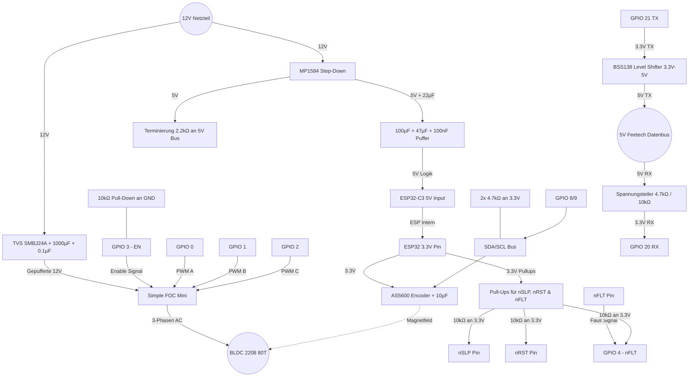

# 02. Hardware & Schaltplan

Dieses Dokument beschreibt die Verkabelung und die essenziellen Passivbauteile (Schutzschaltungen) für den stabilen Betrieb des BLDC 2208 80T am Simple FOC Mini v1.0.

## 1. Schutzschaltungen & Passivbauteile (Hardening)

Um einen zuverlässigen Dauerbetrieb zu gewährleisten und die Hardware vor Spannungsspitzen, Signalfehlern und Boot-Konflikten zu schützen, sind folgende Komponenten zwingend erforderlich:

### 1.1 VMOT Flyback- & Überspannungsschutz
BLDC Motoren können bei abruptem Abbremsen oder Blockieren als Generator wirken und hohe Spannungsspitzen ins Netz zurückspeisen.
*   **Bauteile:** 1x 1000 µF Elektrolytkondensator (Low ESR) + 1x 0.1 µF Keramikkondensator + 1x TVS-Diode **SMBJ24A** (bei 12V-24V) oder **SMBJ15A** (bei 12V) (alle parallel).
*   **Position:** Zwischen `VMOT` (Spannungseingang am Simple FOC Mini) und `GND`. So nah wie möglich an den Strom-Eingangspins des Treiber-Boards platzieren.

### 1.2 Glättung & MCU-Pufferung (Gegen Brownouts)
Verhindert, dass der ESP32-C3 durch Spannungseinbrüche während hoher Motorlasten abstürzt (Resets).
*   **Bauteile (5V Schiene):** 1x 100 µF Elko + 1x 47 µF Keramikkondensator (X7R, 1206, ≥16V) + 1x 100 nF Keramikkondensator.
*   **Position:** Direkt am 5V-Eingangspin des ESP32-C3 Super Mini.
*   **AS5600 Puffer:** 1x 10 µF Keramikkondensator nahe am VCC/GND-Pin des AS5600.
*   **Step-Down Puffer:** 1x 22 µF Keramikkondensator am Ausgang des MP1584EN.

### 1.3 I²C Pull-Up Widerstände (Für stabile 400 kHz)
Der AS5600 benötigt definierte HIGH-Pegel für saubere I2C-Kommunikation. Die internen Pull-Ups des ESP32-C3 sind zu schwach.
*   **Bauteile:** 2x 4.7 kΩ Widerstände.
*   **Position:** Einer von `SDA` an `3.3V` und einer von `SCL` an `3.3V`.

### 1.4 Boot-Safe Pull-Down am Enable Pin
Verhindert, dass der Motor unkontrolliert anläuft, während der ESP32-C3 bootet und die Pins noch im undefinierten Zustand (Floating) sind.
*   **Bauteil:** 1x 10 kΩ Widerstand.
*   **Position:** Zwischen `EN` (Enable-Pin des Simple FOC, Active-HIGH) und `GND`. Hält den Treiber deaktiviert, bis der ESP den Pin bewusst auf HIGH zieht.

### 1.5 nSLP & nRST Aktivierungs-Pull-Ups
*   **Problem:** Der DRV8313 besitzt interne 100kΩ Pull-Downs. Bleiben `nSLP` und `nRST` unbeschaltet, bleibt der Chip im Sleep/Reset-Zustand.
*   **Bauteile:** 2x 10 kΩ Widerstände.
*   **Position:** Von `nSLP` gegen `3.3V` und von `nRST` gegen `3.3V` (zieht die Pins dauerhaft HIGH und aktiviert den Treiber).

### 1.6 nFLT Fault-Feedback
*   **Bauteil:** 1x 10 kΩ Widerstand.
*   **Position:** Von `nFLT` (Fault-Ausgang des Simple FOC, Open-Drain) gegen `3.3V`. Der Pin wird an `GPIO 4` des ESP32-C3 angeschlossen, um Treiberfehler (Überstrom/Übertemperatur) in der Firmware abzufangen.

### 1.7 Split-Path Level Shifter für Feetech-Bus (1 Mbps Stabilität)
Verhindert Signalverrundungen und Frame-Fehler bei hohen Baudraten (1 Mbps), indem Sende- und Empfangspfad auf der 3.3V-Seite getrennt bleiben.
*   **Bauteile:** 1x BSS138 MOSFET (für TX) + 1x Spannungsteiler (4.7 kΩ Serie, 10 kΩ gegen GND, für RX) + 1x 2.2 kΩ Pull-Up (Terminierung).
*   **Position:**
    *   **TX-Pfad:** ESP32 TX (`GPIO 21`) → Gate/Source des BSS138 (Pegelwandlung 3.3V → 5V) → 5V Feetech Bus.
    *   **RX-Pfad:** 5V Feetech Bus → Spannungsteiler (4.7 kΩ / 10 kΩ) → ESP32 RX (`GPIO 20`).
    *   **Terminierung:** 2.2 kΩ Pull-Up von der 5V Feetech-Datenleitung gegen 5V.

---

## 2. Pin-Belegung & Architektur

### ESP32-C3 Super Mini Pinout:
*   **5V & GND:** Logikstromversorgung vom MP1584EN (mit 100µF + 47µF + 100nF Pufferung).
*   **3.3V & GND:** Sensorstromversorgung (AS5600) und Referenz für Level Shifter LV.
*   **GPIO 0 (PWM A):** Simple FOC IN1.
*   **GPIO 1 (PWM B):** Simple FOC IN2.
*   **GPIO 2 (PWM C):** Simple FOC IN3.
*   **GPIO 3 (EN):** Simple FOC Enable (mit 10kΩ Pull-Down an GND).
*   **GPIO 4 (nFLT):** Simple FOC Fault-Eingang (mit 10kΩ Pull-Up an 3.3V).
*   **GPIO 8 (SDA):** AS5600 SDA (mit 4.7kΩ Pull-Up an 3.3V).
*   **GPIO 9 (SCL):** AS5600 SCL (mit 4.7kΩ Pull-Up an 3.3V).
*   **GPIO 20 (RX):** Feetech Bus Empfang (über 4.7kΩ / 10kΩ Spannungsteiler von 5V Bus).
*   **GPIO 21 (TX):** Feetech Bus Senden (über unidirectional BSS138 Level Shifter auf 5V Bus).

### Stromversorgung (Power Routing)
1. **12V Hauptnetzteil:** Geht an Simple FOC Mini (VMOT/GND) und an den MP1584EN Step-Down (Eingang).
2. **MP1584EN Step-Down:** Wandelt 12V auf exakt **5.0V** um (Ausgang lokal mit 22µF gepuffert).
3. **5V Rail:** Versorgt den Level Shifter (HV-Referenz/Bus-Terminierung) und den 5V Eingang des ESP32-C3 Super Mini.
4. **3.3V Rail:** Vom ESP32-C3 3.3V Pin an den AS5600 Sensor und als Pull-Up-Referenz für nSLP, nRST und nFLT.

---

## 3. Logischer Schaltplan (Mermaid)

