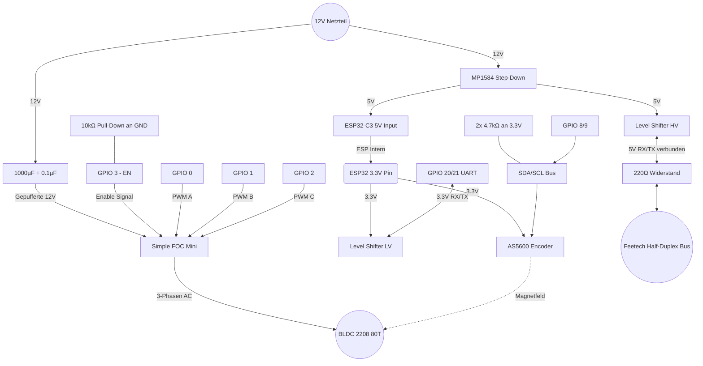

# 02. Hardware & Schaltplan

Dieses Dokument beschreibt die Verkabelung und die essenziellen Passivbauteile (Schutzschaltungen) für den stabilen Betrieb des BLDC 2208 80T am Simple FOC Mini v1.0.

## 1. Schutzschaltungen & Passivbauteile (Hardening)

Um einen zuverlässigen Dauerbetrieb zu gewährleisten und die Hardware vor Spannungsspitzen zu schützen, sind folgende Komponenten zwingend erforderlich:

### 1.1 VMOT Puffer-Kondensatoren (Flyback-Schutz)
BLDC Motoren können bei abruptem Abbremsen als Generator wirken und Spannungsspitzen ins Netz zurückspeisen.
*   **Bauteile:** 1x 1000 µF Elektrolytkondensator (Low ESR) + 1x 0.1 µF Keramikkondensator (parallel).
*   **Position:** Zwischen `VMOT` (12V Input am Simple FOC Mini) und `GND`. So nah wie möglich an die Strom-Eingangspins des Treiber-Boards löten.

### 1.2 I²C Pull-Up Widerstände (Für stabile 400 kHz)
Der AS5600 benötigt definierte HIGH-Pegel für saubere I2C-Kommunikation. Die internen Pull-ups des ESP32-C3 sind zu schwach.
*   **Bauteile:** 2x 4.7 kΩ Widerstände.
*   **Position:** Einer von `SDA` an `3.3V` und einer von `SCL` an `3.3V`.

### 1.3 Boot-Safe Pull-Down am Enable Pin
Verhindert, dass der Motor unkontrolliert anläuft, während der ESP32-C3 bootet und die Pins noch in einem undefinierten Zustand (Floating) sind.
*   **Bauteil:** 1x 10 kΩ Widerstand.
*   **Position:** Zwischen `EN` (Enable-Pin des Simple FOC) und `GND`. Hält den Treiber deaktiviert, bis der ESP den Pin bewusst auf HIGH zieht.

### 1.4 Bus-Kurzschluss-Schutz (Feetech 1-Wire)
Schützt den Level-Shifter und den ESP32 vor Überströmen auf der Feetech-Datenleitung.
*   **Bauteil:** 1x 220 Ω Widerstand.
*   **Position:** In Reihe in der 5V-Datenleitung (zwischen Level Shifter und dem externen Bus).

## 2. Pin-Belegung & Architektur

### ESP32-C3 Super Mini Pinout:
*   **3.3V & GND:** Logikstromversorgung vom MP1584.
*   **GPIO 8 (SDA):** AS5600 SDA.
*   **GPIO 9 (SCL):** AS5600 SCL.
*   **GPIO 0 (PWM A):** Simple FOC IN1.
*   **GPIO 1 (PWM B):** Simple FOC IN2.
*   **GPIO 2 (PWM C):** Simple FOC IN3.
*   **GPIO 3 (EN):** Simple FOC Enable.
*   **GPIO 20 (RX):** Level Shifter (3.3V Seite).
*   **GPIO 21 (TX):** Level Shifter (3.3V Seite).

### Stromversorgung (Power Routing)
1. **12V Hauptnetzteil:** Geht an Simple FOC Mini (VMOT/GND) und an den MP1584 Step-Down.
2. **MP1584 Step-Down:** Wandelt 12V auf exakt **5.0V**.
3. **5V Rail:** Versorgt den Level Shifter (5V Referenz/HV) und den 5V Eingang des ESP32-C3 Super Mini (der intern eigene 3.3V generiert).
4. **3.3V Rail:** Vom ESP32-C3 3.3V Pin an den Level Shifter (3.3V Referenz/LV) und an den AS5600 Sensor.

## 3. Logischer Schaltplan (Mermaid)

